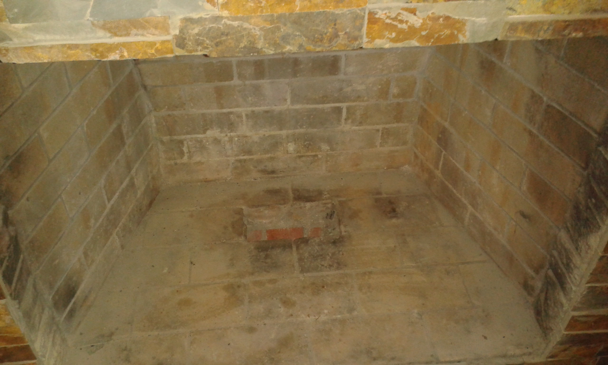
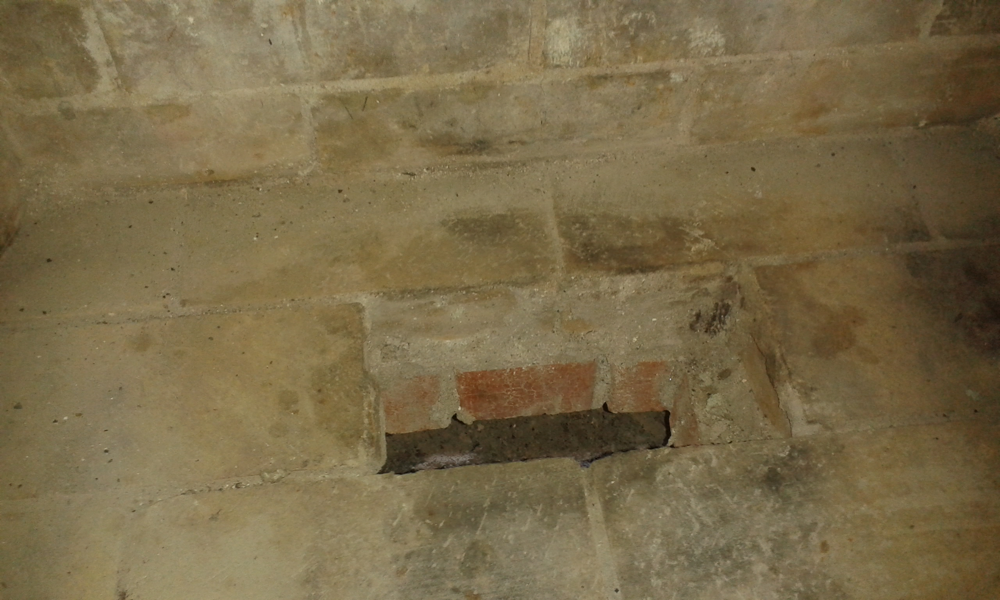
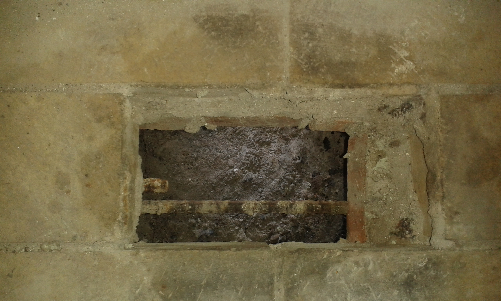
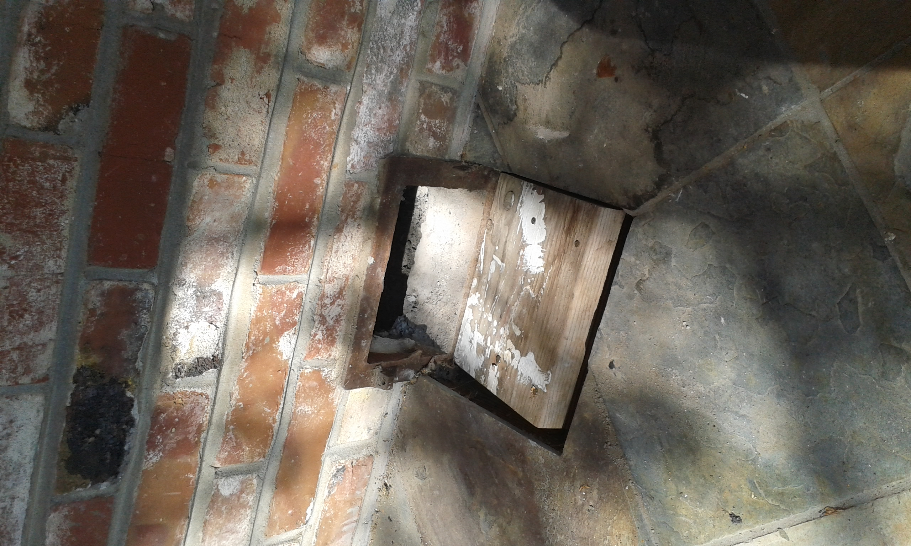
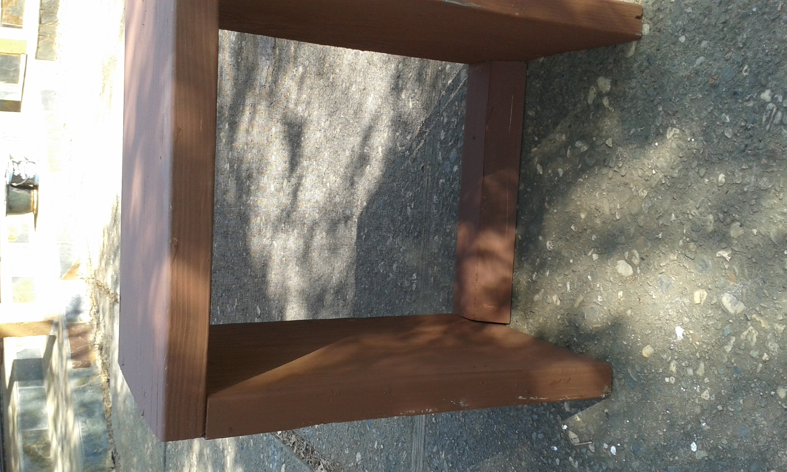
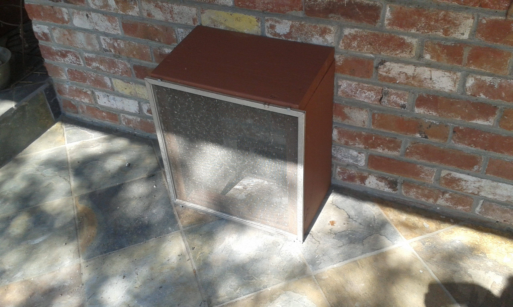
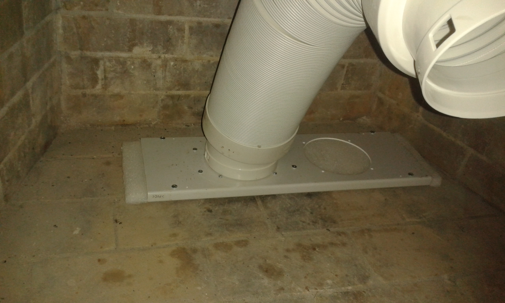
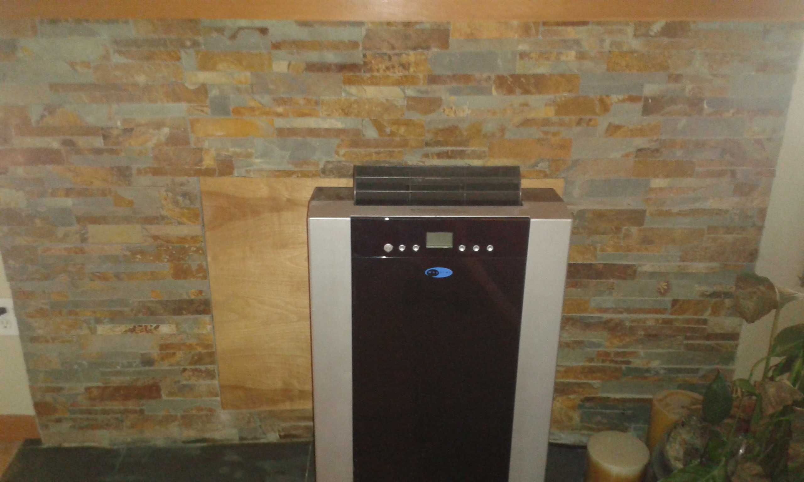

<html>
<h2>Heat Pump</h2>
The solar system was installed in August of 2018 and we used local electrical
space heaters for the first two years. This is easy to see on the solar graphs
since the electrical use goes up a lot during the winter.

<h3>Selecting a Heat Pump</h3>
In September of 2020, we purchased a heat pump. A heat pump should be two or
three times more efficient than electrical heaters, especially in a mild climate.
Another advantage is that it can be used as an air conditioner, which we could
use for the few days a year when it is extremely hot.

I looked around for quite a while looking at various types of heat pumps. There
are whole house heat pumps, but we mainly want to heat a smaller living space
much of the time. There are some called "Mini Split" heat pumps, but these to
require a bit more work to install like putting some holes in walls, and possibly
working with refrigerant.

We finally settled on what is called a "portable" heat pump. These usually require
a window opening, but we didn't have one since they must normally be sliding style windows.

I looked around a bit for whether to use a mini split system or some way of running
a vent. 
But then I realized we do have a fireplace that we never use with a cleanout
accessible to the outside.

<h3>Fireplace Cleanout</h3>
The fireplace cleanout inside the house looks like the following.
 

<h3>Outside</h3>
The heat pump will be more efficient if it has an easy way to expel air.
For this reason, I made an outside vent cover that has a large area for air.
The main idea is to keep animals from getting into the house and to
provide an easy access for air to get out of the house.
I made a ramp to improve the air flow.

This is the back of the vent. There is no back bottom brace to prevent
air flow. 

I found an old screen, and cut it to side for some old wood I had lying around. 

<h3>Inside</h3>
The hose should be as short as possible to prevent restriction of air.
The supplied extended hose is six feet. The metal part and hose connectors
were supplied with the unit. I took some old plastic padding and fit it into the
metal piece to provide a bit more insulation and bug proofing.

So why do we need only one vent to the outdoors from the heat pump? The
heat pump can be set up where the input air is retrieved from inside the
house, and push the air to the outside. This is typically efficient if
the indoor temperature is close to the desired temperature and if it is
able to draw air from somewhere else in the house so that there is not a
vacuum. Our house is pretty well insulated, but the system seems to work fine.

I put some foam sheet insulation into the chimney to prevent a bit more air flow.
Then for the fireplace cover, 
I took a piece of wood and glued foam insulation to it. This isolates
the inside of the fireplace from the rest of the house.

</html>

