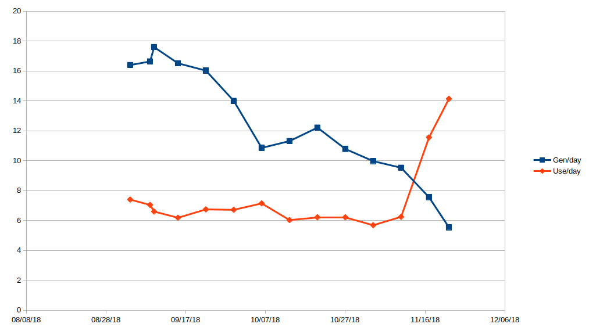
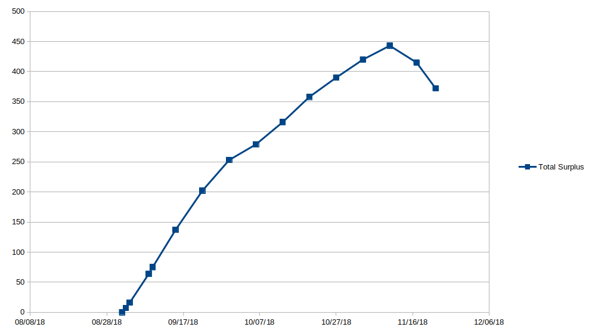

# solar
Hopefully helpful information about installing solar for a residence

<h3>Introduction</h3>
First a couple of graphs to as an introduction, then later get into the details. A 3.24 kW grid-tied system with 12 panels was installed on August of 2018. This first graph shows the amount of electricity generated, and the amount used. This is with no electric car and pretty minimal use of other electricity.

This graph shows the amount of surplus electricity. My utility has an annual true-up program, which means the amount you owe or are paid is figured out once per year. The goal generally is to generate the same amount of electricity over the year as you use.

<h3>Initial Goals</h3>
I wanted to be green, so I didn't mind paying a bit more for a system that is currently needed. I would expect that I will have an electric vehicle in the future. It is also typically true that you will get paid less for the electricty that is generated than you might expect, especially since it might be the case that electrical costs could drop in the future. So currently I plan to use the excess for electric heating in the winter, which will reduce the natrual gas furnace usage.

<h3>Figuring out Use</h3>
<h4>Electric Use</h4>
I figured out current use two ways. The first was to find the devices in the home that are using electricty. I used a Watt meter (Killawatt) to measure different devices and multiplied by estimated time of use. I am showing these numbers just to give an idea of what some devices can use.

<table>
  <tr><th>Wh/day</th><th>Device</th><th>Description</th></tr>
  <!-- Kitchen -->
  <tr><td>1232</td><td>Refrigerator</td><td>Energy rating between 435 and 470 = 450 kWh per year/365 = 1232 Wh</td></tr>
  <tr><td>400</td><td>Oven</td><td>2400W * 5 hours per month / 30 days</td></tr>
  <tr><td>200</td><td>Microwave</td><td>1200W * .16h (10 minutes) = 360</td></tr>
  <tr><td>13</td><td>Range</td><td>800W * .5h * 5 days / 30 days</td></tr>
  
  <tr><td>100</td><td>Washer</td><td>500W * 40 minutes = 350W * 2 people / 7 = 100 Wh</td></tr>

<!-- Entertainment/work -->
  <tr><td>540</td><td>TV</td><td>0W when off, 90W * 6h</td></tr>
  <tr><td>480</td><td>Cable Box</td><td>12-20W * 8h (19W when off, same as on?) = 20*24</td></tr>
  <tr><td>168</td><td>Computer</td><td>56W * 3h</td></tr>
  <tr><td>75</td><td>Computer Monitor</td><td>25W * 3h</td></tr>
  <tr><td>240</td><td>Cable Router</td><td>10W * 24h</td></tr>
  <tr><td>40</td><td>Home Router</td><td>5W * 8h</td></tr>

<!-- Lighting -->
  <tr><td>132</td><td>LED Living Lights</td><td>12 W * 4 lights * .7 dimmed * 3 hours = 132 Wh</td></tr>
  <tr><td>156</td><td>Office Lights</td><td>26 W * 2 lights * 3 hours = 156 Wh</td></tr>

  <tr><td>96</td><td>POE Injector</td><td>4W * 24</td></tr>
  <tr><td>3904</td><td>Total</td><td>Wh per day</td></tr>
  </table>

By doing this exercise, I was able to find a few things we weren't really using, and I was surprised at what the entertainment cost was and that the Cable Box indicated that we were saving electricity when it was off, but really wasn't. Unplugging is more important than expected.

I also looked at a cable bill and found that our actual use for one month was 186 kWh, which means that our actual use is about 186kWh/month / 31 days = 6kWh/d. So the measurements and calculations above are not completely accurate. We must be using things a bit more than expected.

<h4>Electric and Natural Gas Use and Cost</h4>
The following table shows actual electrical cost for one year (2017).
<table>
  <tr><th>Quantity</th><th>Calculation</th><th>Description</th></tr>
  <tr><td>190 kWh per Month</td><td>159+148+128+145+142+199+197+136+134+209+242+180+217/12=186</td><td>Total Electrical</td></tr>
  <tr><td>22$ per Month</td><td>31+30+17+19+19+27+26+18+18+28+32=265$/12</td><td>Total Cost</td></tr>
  </table>
The following shows gas cost for one year (2017).
<table>
  <tr><th>Quantity</th><th>Calculation</th><th>Description</th></tr>
  <tr><td>190 Therms/Year</td><td>27+17+5+4+5+4+4+4+8+28+34+19+31</td><td>Total Heating and Water Heater</td></tr>
  <tr><td>22.6$/Month</td><td>39+24+7+7.1+5.7+6.8+5.4+5.2+5.2+10.8+38+48+27+43=272$/12</td><td>Total Cost</td></tr>
  <tr><td>142 Therms/Year</td><td>190-(48 water heater)</td><td>Heating Only</td></tr>
  <tr><td>17$/Month</td><td>272$ - (5.5*12=66:water heater) = 206$ / 12 = 17$</td><td>Heating Only Cost</td></tr>
  <tr><td>48 Therms/Year</td><td>12*4=48</td><td>Water Heater</td></tr>
  </table>

<h3>Estimating Future Use</h3>
<h4>Electric Car</h4>
I looked at a few sample cars (2017) to see what the electricty use would be.
<table>
  <tr><th>MPGe</th><th>Car</th><th>Notes</th></tr>
  <tr><td>136</td><td>Hundai Ioniq</td><td></td></tr>
  <tr><td>128</td><td>Tesla Model 3</td><td>long range model</td></tr>
  <tr><td>124</td><td>BMW i3</td><td></td></tr>
  <tr><td>119</td><td>Chevy Bolt</td><td></td></tr>
  <tr><td>112</td><td>Nissan Leaf</td><td></td></tr>
  </table>

My typical driving at the moment is less than 8K miles/year = 21 miles per day. A Tesla Model 3 will go 100 miles on 23.7 kWh.
So 23.7 / 100 = .237 kWh per mile * 21 miles = 4.977 or about 5 kWh per day. This means an electric car would double our electricty use.

<h4>Electric Heating</h4>
We used 142 Therms per year for gas heating. 142 therms = 4146 kWh. 4146 / 12 months = 346 kWh, or 4146 / 365 days = 11.4 kWh per day. Using electrical for all of our heating would triple our electrical use.
