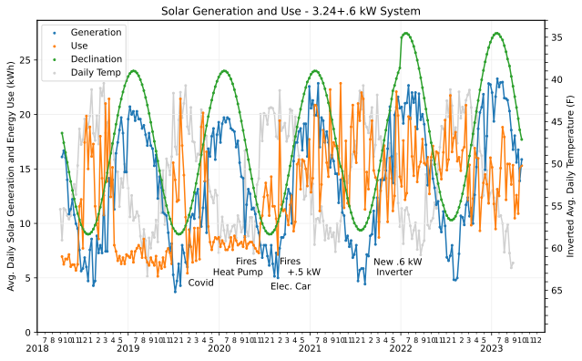
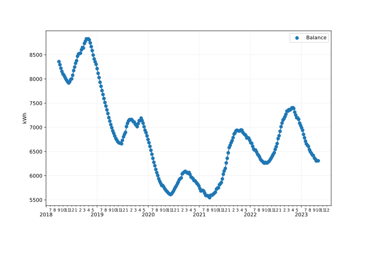
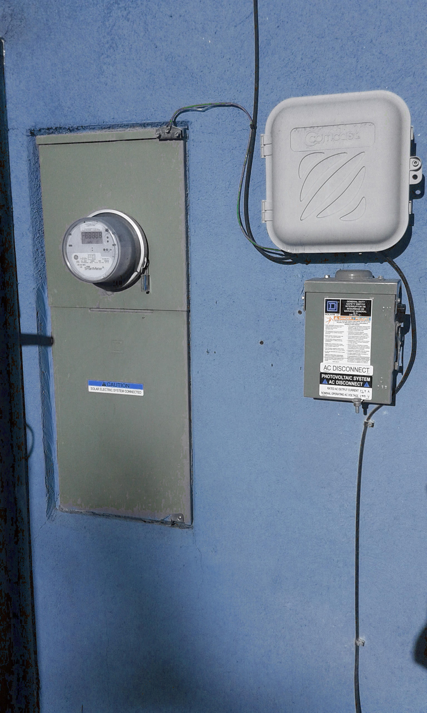

# solar
Hopefully helpful information about installing solar for a residence

<a href="#Intro">Introduction</a> 
<a href="#Selection">Selecting a System</a> 
<a href="#Planning">Planning the System</a> 
<a href="#Install">Installing the System</a> 

<h2 id="Intro">Introduction</h2>
First a couple of graphs as an introduction, then later get into the details. A 3.24 kW grid-tied system with 12 panels was installed on August of 2018. 

This first graph shows the amount of electricity generated, and the amount used. It also shows the solar declination, which is the angle that the sun hits the earth. The usage is with no electric car and pretty minimal use of other electricity, but some electrical use for heating in the winter. This means that for the first year, we have used natural gas for heating for a couple of days.

The following graph shows the amount of surplus electricity. My utility has an annual true-up program, which means the amount you owe or are paid is figured out once per year. The goal generally is to generate the same amount of electricity over the year as you use. Note that coming out even for the year would be getting back to zero, so this indicates a large surplus the first year.

<h2 id="Selection">Selecting a System</h2>
<h3>Initial Goals</h3>
I wanted to be green, so I didn't mind paying a bit more for a system that is currently needed. I would expect that I will have an electric vehicle in the future. It is also typically true that you will get paid less for the electricty that is generated than you might expect, especially since it might be the case that electrical costs could drop in the future. So currently I plan to use the excess for electric heating in the winter, which will reduce the natrual gas furnace usage.

<h3>Estimating Use</h3>
<h4>Electric Use</h4>
I figured out our current use two ways. The first was to find the devices in the home that are using electricty. The second was by using utility bills.

I used a Watt meter (Killawatt) to measure different devices and multiplied by estimated time of use. I am showing these numbers just to give an idea of what some devices can use.

<h4>Finding Electric Use by Device Consumption</h4>

<table>
  <tr><th>Wh/day</th><th>Device</th><th>Description</th></tr>
  <!-- Kitchen -->
  <tr><td>1232</td><td>Refrigerator</td><td>Energy rating between 435 and 470 = 450 kWh per year/365 = 1232 Wh</td></tr>
  <tr><td>400</td><td>Oven</td><td>2400W * 5 hours per month / 30 days</td></tr>
  <tr><td>200</td><td>Microwave</td><td>1200W * .16h (10 minutes) = 360</td></tr>
  <tr><td>13</td><td>Range</td><td>800W * .5h * 5 days / 30 days</td></tr>
  
  <tr><td>100</td><td>Washer</td><td>500W * 40 minutes = 350W * 2 people / 7 = 100 Wh</td></tr>

<!-- Entertainment/work -->
  <tr><td>540</td><td>TV</td><td>0W when off, 90W * 6h</td></tr>
  <tr><td>480</td><td>Cable Box</td><td>12-20W * 8h (19W when off, same as on?) = 20*24</td></tr>
  <tr><td>168</td><td>Computer</td><td>56W * 3h</td></tr>
  <tr><td>75</td><td>Computer Monitor</td><td>25W * 3h</td></tr>
  <tr><td>240</td><td>Cable Router</td><td>10W * 24h</td></tr>
  <tr><td>40</td><td>Home Router</td><td>5W * 8h</td></tr>

<!-- Lighting -->
  <tr><td>132</td><td>LED Living Lights</td><td>12 W * 4 lights * .7 dimmed * 3 hours = 132 Wh</td></tr>
  <tr><td>156</td><td>Office Lights</td><td>26 W * 2 lights * 3 hours = 156 Wh</td></tr>

  <tr><td>96</td><td>POE Injector</td><td>4W * 24</td></tr>
  <tr><td>3904</td><td>Total</td><td>Wh per day</td></tr>
  </table>

By doing this exercise, I was able to find a few things we weren't really using, and I was surprised at what the entertainment cost was and that the Cable Box indicated that we were saving electricity when it was off, but really wasn't. Unplugging is more important than expected in some cases.

I also looked at utility bills and found that our actual use for one month was 186 kWh, which means that our actual use is about 186kWh/month / 31 days = 6kWh/d. So the measurements and calculations above are not completely accurate. We must be using things a bit more than expected.

<h4>Finding Electric and Natural Gas Use and Cost from Utility Bills</h4>

The following table shows actual electrical cost for one year (2017).
<table>
  <tr><th>Quantity</th><th>Calculation</th><th>Description</th></tr>
  <tr><td>180 kWh per Month</td><td>145+142+199+197+136+134+209+242+180+217+186+172=2159/12=180</td><td>Total Electrical</td></tr>
  <tr><td>25$ per Month</td><td>20+19+27+27+18+18+28+33+25+30+27+25=296/12=24.72</td><td>Total Cost</td></tr>
  </table>
The following shows gas cost for one year (2017).
<table>
  <tr><th>Quantity</th><th>Calculation</th><th>Description</th></tr>
  <tr><td>156 Therms/Year</td><td>4+5+4+4+4+8+28+34+19+31+10+5=156/12=13</td><td>Total Heating and Water Heater</td></tr>
  <tr><td>18.16$/Month</td><td>6+7+5+5+5+11+39+48+27+44+14+7=217.93/12=18.16</td><td>Total Cost</td></tr>
  <tr><td>108 Therms/Year</td><td>156-(48 water heater)</td><td>Heating Only</td></tr>
  <tr><td>14$/Month</td><td>217$ - (4*12=48:water heater) = 169$ / 12 = 14$</td><td>Heating Only Cost</td></tr>
  <tr><td>48 Therms/Year</td><td>12*4=48</td><td>Water Heater</td></tr>
  </table>

<h3>Estimating Future Use</h3>
<h4>Electric Car</h4>
I looked at a few sample cars (2017) to see what the electricty use would be.
<table>
  <tr><th>MPGe</th><th>Car</th><th>Notes</th></tr>
  <tr><td>136</td><td>Hundai Ioniq</td><td></td></tr>
  <tr><td>128</td><td>Tesla Model 3</td><td>long range model</td></tr>
  <tr><td>124</td><td>BMW i3</td><td></td></tr>
  <tr><td>119</td><td>Chevy Bolt</td><td></td></tr>
  <tr><td>112</td><td>Nissan Leaf</td><td></td></tr>
  </table>

My typical driving at the moment is less than 8K miles/year = 21 miles per day. A Tesla Model 3 will go 100 miles on 23.7 kWh.
So 23.7 / 100 = .237 kWh per mile * 21 miles = 4.977 or about 5 kWh per day. This means an electric car would double our electricty use.

<h4>Electric Heating</h4>
We used 108 to 142 Therms per year for gas heating. 142 therms = 4146 kWh. 4146 / 12 months = 346 kWh, or 4146 / 365 days = 11.4 kWh per day. Using electrical for all of our heating could triple our electrical use.

<h3>Solar Energy and Efficiency</h3>
You can skip this section to use the online caclulator described below in Solar System Size or us this calculator <a href="https://pvwatts.nrel.gov">https://pvwatts.nrel.gov</a>. This section gives a liitle more information about the details of a calculator and what is important for roof angles, and your location.

You can find sun angles for your location from different web sites such as <a href="https://www.esrl.noaa.gov/gmd/grad/solcalc/azel.html">https://www.esrl.noaa.gov/gmd/grad/solcalc/azel.html</a> or <a href="http://solarelectricityhandbook.com/solar-angle-calculator.html">http://solarelectricityhandbook.com/solar-angle-calculator.html</a>.
My winter angle is about 60 degrees from horizontal and the summer angle is about 25 degrees. My roof pitch is 18.43 degrees.
The solar panels I was investigating were about 18.6% efficient. The solar declination for my location was about 23 degrees.
Putting on a north roof drops efficiency by about 34% and subtract another 7% for roof azimuth angle.

There are a few ways to figure out peak sun hours. There is a calculator here where you can enter your zip code.
<a href="https://tyconsystems.com/html/nrel_lookup.htm">https://tyconsystems.com/html/nrel_lookup.htm</a>.
For my location, I got, Dec = 3.72, Jul = 7.32. So the average of the two is 3.72+7.32/2 = .552

Another way is to use https://solarenergylocal.com and use a map to select location. For summer I got 7.02 and for winter 3.62, so the average is 3.62+7.02/2 = .532

This site shows the roof angle information.
<a href="https://www.civicsolar.com/support/installer/articles/calculating-your-optimal-azimuth-angle">
  https://www.civicsolar.com/support/installer/articles/calculating-your-optimal-azimuth-angle</a>

For my location, it seels like the efficiency is about 1/2 the total during winter, and another 10% lower for azimuth and roof angle. Actual measurements so far seems like it is about 1/3 the total during winter. This also matches the nrel.gov site.
<h3>Solar System Size</h3>
<table>
  <tr><th>kWh</th><th>System</th><th>Calculation</th></tr>
  <tr><td>195</td><td>Base use (home only, no heating or car)</td><td>6.3 kWh per day * 31 days</td></tr>
  <tr><td>541</td><td>Base use with heating</td><td>195 kWh + 346 kWh</td></tr>
  <tr><td>696</td><td>Base use with heating and car</td><td>541 kWh + (5 kWh * 31 days)</td></tr>
  </table>
I used the Wholesale Solar web site at 
<a href="https://www.wholesalesolar.com/solar-information/solar-cost">
  https://www.wholesalesolar.com/solar-information/solar-cost</a> and
  <a href="https://www.wholesalesolar.com/solar-information/start-here/offgrid-calculator">
  https://www.wholesalesolar.com/solar-information/start-here/offgrid-calculator</a> to evaluate cost. I eventually purchased a system from that company since it sells a kit and you can install it yourself. I evaluated the following systems.
<table>
  <tr><th>System Size</th><th>Panels</th><th>System</th><th>Calculation</th></tr>
  <tr><td>149 kWh</td><td>4 270W panels</td><td>Partial base use, no car, no heating</td>
    <td>2497$ for 1.08kW / (148/186=.8*471=375) = 6.6 years</td></tr>
  <tr><td>316 kWh</td><td>8 290W panels</td><td>Base use, no car, no heating</td>
    <td>4728$ for 2.32 kW/265$ = 18 Years</td></tr>
  <tr><td>447 kWh</td><td>12 270W panels</td><td>Partial base use with heating</td>
    <td>5619$ for 3.24kW kW/(265+206=471$) = 12 years</td></tr>
  <tr><td>475 kWh</td><td>12 290W panels</td><td>Base use with heating</td>
    <td>6355$ for 3.48kW / (265+206=471$) = 13.5 years</td></tr>
  </table>
  
Notes about the system size:
<ul>
  <li>For the 475 kWh numbers, 290 * 12 = 3480 so these must be peak numbers.</li>
  <li>PTC numbers can be looked
				up at <a href="https://www.gosolarcalifornia.org/equipment/documents/PV_Module_List_Simplified_Data.xlsx">
    https://www.gosolarcalifornia.org/equipment/documents/PV_Module_List_Simplified_Data.xlsx</a></li>
  <li>PTC=266.3 * 95% inverter = 252.98 * 12 panels = 3.035 CEC-AC</li>
  <li>3.035 CEC-AC * 5.84 peak sun hours = 17.7kWh/day = 17.7 * 31 days = 548.7 kWh</li>
  <li>These numbers are a bit off from their web site numbers, so perhaps they added in roof pitch or something.</li>
  <li>The payoff numbers are a bit off from my actual use since I originally used different base use
	  numbers due to the fact that I didn't have the complete use numbers at the time.</li>
  <li>I used the following to calculate electrical costs, 6kWh * .15 = 0.9$ per day = 328$ per year. This was
	a bit off since my actual electrical cost for the full year was 217$.</li>
  </ul>

<h3>Solar Tax Credit</h3>
There is a federal solar tax credit that was extended in 2016. It covers a percentage of the cost of the system.
<table>
	<tr><th>Year</th><th>Percent</th></tr>
	<tr><td>2018</td><td>30</td></tr>
	<tr><td>2019</td><td>30</td></tr>
	<tr><td>2020</td><td>26</td></tr>
	<tr><td>2021</td><td>22</td></tr>
	<tr><td>2022</td><td>10</td></tr>
</table>

<h3>Selecting a Grid-Tied System</h3>
There is one more important part of selecting a system. There are a few types of grid tied systems.
<table>
  <tr><th>System Type</th><th>Description</th</tr>
  <tr><td>Minimal</td><td>I believe this ties all of the panels together. If a single panel has sun blockage,
	  then output from other panels can also be reduced.</td</tr>
  <tr><td>Power Optimizer</td><td>This is a small box at each panel that communicates with the main inverter
	  to optimize the DC voltage for each panel to send to the inverter. This system is very safe and easy to install
	  since there is no output if it is not connected to the inverter. It actually outputs a low 1V output
	  for each panel so it is easy to see how many panels are connected correctly.</td</tr>
  <tr><td>Micro Inverter</td><td>This is a small box at each panel that converts the DC to AC so that no
	  main inverter is needed. This is typically higher cost since many small micro inverters are more
	  expensive than a single large inverter.</td</tr>
  <tr><td>With Storage</td><td>I don't think this system was available at the time that I purchased a system.</td</tr>
  </table>

I ended up picking the 447 kWh system with power optimizers because I have a tree and fireplace that could block output from some panels.  The panels are rated at 80% output at 25 years. I will redo the system payoff calculations later since the total system cost is higher than shown here.

<!-- 7500$ system cost / 471$ actual gas+electric cost per year(2017)=15.9 years, must also add in grid connect cost -->
With this system, we plan to use a very small amount of electricity in the summer, and generate a lot. So there is no way for us to save it in batteries. Plus I am not sure if there is a way to not be connected to the grid partly for fire safety reasons. The city/county seem to have a goal that if the utility goes off, so does your solar, then if there is a fire, the firefighters won't get shocked. This also makes it very easy to install some systems (like the one I got) since there is no electrical on the system (except right at the panels) when you install it.

We will generate excess electricity in the summer that goes back to the grid, then use a lot in the winter for heating. So the excess in the summer goes towards other people's AC units, which can still reduce the amount of utility plant generation even if we aren't using it.
	  
<h2 id="Planning">Planning the System</h2>
I originally started making the plans on my own. In my case the city controls solar permits and the city requires the following:
<ul>
  <li>A drawing of the plot of land and house showing the solar panels</li>
  <li>Electrical diagrams and codes that show the solar system from the main junction box to the panels</li>
  <li>How the system attaches to the rafters</li>
  <li>The manufacture information about all of the solar hardware including racks, footings, inverter, panel, grounding parts, etc.</li>
  </ul>
I was able to download the fire marshal codes from the state. This gave useful information about leaving space (18" or 36") for walkway areas on the roof for firefighters. I also already had house diagrams from a previous remodel of the house. The main problem is that I had very little knowledge of the electrical and codes.

For this reason, I decided to purchase plans from Wholesale Solar. The plans cost about 1000$. They allowed a deal where I could pay 15% of the system plus the plan cost, and then pay the total solar system cost later after plans were completed and passes local permitting rules through city.

There were a few mistakes and adjustments made to the plans.
<ul>
  <li>I was originally thinking I would put panels only on the southwest roof. Their plans shows panels on the
    southwest, southeast, and northeast. This would make the install more difficult.
    They put some on the northeast because they assumed we had a tree that
    would block a lot of solar. I told them we were going to trim the tree since much of it was dead. They
    changed the plans according to my request. The fact that they had solar on the southeast was better than
    my plans, so I am glad that they calculated better than I did. They subcontracted out the calculations to
    <a href="https://www.brightharvestsolar.com/">https://www.brightharvestsolar.com/</a>. These plans
    were pretty nice because they showed the maximum number of panels that could go on the house and
    the estimated relational efficiency of the panels including shading from trees. It might have been nice
    to also have a more unshaded information.
    </li>
  <li>There were a few incorrect measurements for panel location on the roof. This mistake was not on
    the Bright Harvest drawings.
    I also originally sent in some drawings with correct measurements, so I am not sure why their
    measurements were wrong. In any case,
    it helped to know the fire code walkway information so that I could install the panels correctly.</li>
  <li>They also shipped fewer footer connectors than were shown on the plans. I checked the manufacturing
    information about the racks to check what the longest span can be without footer connectors,
    and verified that I did not need as many as were shown on the diagrams.</li>
  <li>Even after the revised plans, there were three holes for conduit in the roof when only two
    were necessary. I called Wholesale Solar and they verified that only two were necessary.
    </li>
  </ul>
<h2>Receiving the System</h2>
Wholesale Solar photographs the shipment before sending it. The system comes on two pallets.

<H2 id="Install">Installing the System</h2>
These pictures are generally in the order that I installed the system.  I started from the roof mounting the panels and determining where the penetration holes in the roof would be. Remember that these must be adjacent to a rafter. Then I mounted the inverter taking into consideration the mounting of the AC disconnect box. Then connected the conduit and electrical between all of the pieces. I did not use conduit in the garage wall, and I left the sheetrock off the garage wall for the inspection.
<h3>Southwest Roof</h3>
I started by installing the racks on the roof. It was fairly difficult to find the rafters since the ceiling is sloped, so there is no attic. It was possible to find nails for the ceiling, and one part of the roof did have an attic. I used a long (12") 1/8" drill bit to drill initial rafter holes, and I did have to drill a couple of nail holes where I didn't hit rafters (one into the ceiling and one into the attic), but was able to find the rafters with the long bit. I built a big square out of a couple of pieces of wood and marked where I wanted the feet compared to the roof ridge. Then I could use the square to quickly find the locations of both feet for a rafter. It seemed to work pretty well.

The IronRidge racking system gives two dimensions of adjustment, so it was not that critical where the feet are mounted. Overall the mounting system seems to work very well. The racks are aluminum and serve as a ground from the panels. Then a ground wire must be run all the way to the inverter. The bolts have a system so that they connect to the rack slots when the bolts are rotated. There is no need for finding holes, or sliding parts from the ends of the slots.

I debated whether to mount the conduit penetration point through the roof closer to the solar panels. It might look strange, but the hole in the roof for the conduit is in the location in the picture because that is where the garage wall is. I could have gone through the garage wall, but it would have been much more difficult because the attic is tricky with beams and the sloped ceiling. The conduit is run with a hair over the 3 feet maximum distance without support, but the inspector didn't say anything.

One thing to remember to do is to record the serial numbers of each power optimizer. This may be useful in the future to determine where a poorly performing panel is. The inverter company does not make the information available easily, but there may be software available on the net that allows doing some of this.

The following links show quite a bit of the rack information.
<ul>
	<li>
<a href="https://www.quickmountpv.com/support/videos/conduit-penetration-install.html">
https://www.quickmountpv.com/support/videos/conduit-penetration-install.html</a>
	</li><li>
<a href="https://www.youtube.com/watch?v=5a2mc-LrQlY">https://www.youtube.com/watch?v=5a2mc-LrQlY</a>
	</li><li>
<a href="https://www.wholesalesolar.com/6913221/ironridge/racking/ironridge-xr100-option-d-racks-per-65-x-39-module-inc-grounding#downloads">https://www.wholesalesolar.com/6913221/ironridge/racking/ironridge-xr100-option-d-racks-per-65-x-39-module-inc-grounding#downloads</a>
	</li><li>
<a href="https://www.youtube.com/watch?time_continue=57&v=hkT2fVZ9C5g">https://www.youtube.com/watch?time_continue=57&v=hkT2fVZ9C5g</a>
	</li><li>
<a href="se_power_optimizers_installation_guide.pdf">se_power_optimizers_installation_guide.pdf</a>
	</li></ul>

I like to use this sealant to mount roof flashing. It dries and stays malleable. I make an upside down V with the sealant so that the water can go around the hole in the roof as it runs down the slope of the roof.

The racking system provided with the solar kit doesn't have anything that mechanically connects the electrical junction box to the rack system. I used a small piece of aluminum angle bar about twice the length of the junction box. There are holes in the bottom of the junction box and I drilled holes in the angle bar to match so that the box stays pretty waterproof. Then drilled holes in the angle bar and in the rack so that they could be connected. In the picture below, you can barely see the end of the angle bar.

The picture of the junction box below shows the electrical connections to the solar panel side. The junction box must be waterproof. This picture also shows the angle bar with two bolts to connect to the rack.
I bought a special connector that was not supplied in the solar kit. This connector is not in most
hardware stores, and I had to purchase online.  Wholesale solar sent me information from this web site.
<a href="https://www.heyco.com/Liquid_Tight_Cordgrips/">https://www.heyco.com/Liquid_Tight_Cordgrips</a>

I think the connector I purchased was something like this.
<a href="https://www.amazon.com/Liquid-Tight-Strain-Relief-Cord/dp/B071S7G2K6/ref=sr_1_7?ie=UTF8&qid=1543171969&sr=8-7&keywords=heyco+cord+grip">
https://www.amazon.com/Liquid-Tight-Strain-Relief-Cord/dp/B071S7G2K6/ref=sr_1_7?ie=UTF8&qid=1543171969&sr=8-7&keywords=heyco+cord+grip</a>

I kept some slack wire under the panels in the case that things have to be adjusted, or perhaps for adding more panels in the future. The wiring must be kept off of the roof so that the wind doesn't cause rubbing between the shingles and cable jacket. I used the cable mounts that come with the kit, and also separately purchased some cable ties, which made it quite a bit easier.

In the picture below you can see the bolts holding the panels to the racks. The optimizers are under the panels. It is pretty important to use a voltmeter as you go so that you can measure whether the connections are correct between the panels and optimizers. I found a couple of mistakes as I was going along. You are also supposed to cover the panels when connecting the optimizers. I used a piece of cardboard that the panels were shipped with.

This is a one story house, so I was able to carry the panels onto the roof by myself and completed the entire installation without needing anybody else. I put an old rug on the edge of the roof so that I could push the panels onto the roof from below by sliding the panels onto the rug. This worked really well. It was a bit difficult to install the panels onto the racks by myself, and probably would recommend against doing this especially if there is not much room to stand on below the panels on the roof.

<h3>Southeast Roof</h3>

This was my first time bending conduit, and it's kind of fun. This box is mounted the opposite direction from the
southwest panels because of where the conduit enters.

On this box, the end of the angle bracket is easier to see. The cord grip is also visible.

I was wondering if there were any rules on how close panels can be to electrical, but the inspector didn't say anything.

This shows all panels on the southeast side.

<h3>Electrical</h3>
This shows the conduit from the southwest panels. That is one poor quality bend, but nobody will see it after dark and it works.
Conduit must be supported within 3' of a junction box, and 10' on runs.

The stickers on the box and later on the conduit all came from the solar kit. I laid all stickers out on a large flat space so that I could figure out all sticker locations before mounting them. When the inspector came, he asked where a sticker was on some conduit, and I pointed a bit down the line. I said that that was all the stickers in the kit, and he was ok with it.

I was able to run all conduit in the garage. This was a lot easier than many installations will be.
The conduit must be 10" below the roof because the firefighters may use a saw to cut open the roof.

This shows the conduit going up to the southwest panels. The roof looks strange here because this is an add-on to the house, and this old part of the roof is now under the new roof.

I put some extra vents in the garage. One is above the inverter in an attempt to keep some more air flow around the inverter in order to keep it cooler for longer life.

Finally the conduit down to the inverter. Note that all of the conduit so far has been for the DC electrical to the inverter. The DC wiring was supplied in the kit.

The network wire is connected to the inverter, but I have not set up software for it yet.

This shows the back of the inverter where the AC is going towards the AC disconnect switch. There are many punch out holes in the inverter, so there could be other locations for the AC. This is a very short piece (couple inches) of conduit that just goes into the wall. Then the AC electrical (line side) goes from the main meter box to the AC switch.

The AC disconnect to the solar must be on the outside of the house. I had to move the cable box and I basically moved it without changing the wires much.  I had some difficulty finding two breakers that are required for this system. There was one that was empty, and eventually I discovered another that we were not using. At first I was thinking that two were not available, which would have required running a subpanel.

<h3>Summary</h3>
The following shows some rough parts and cost
<a href="PartsCost.md">Parts Cost</a>.
Total cost was about 7385$ - 2216$ (federal rebate) = 5169$.

If you have any questions or comments, please let me know.

A good summary may take some time because the system has been used such a short amount of time. Wait till next time.
